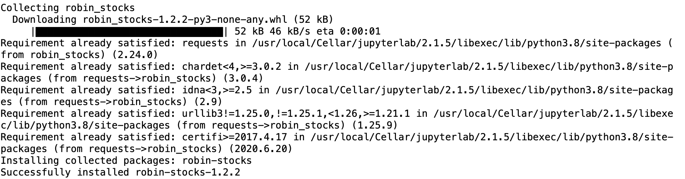

<!-- Markdown version of the tutorial -->

# Robinhood API Tutorial

1. [Setting up your development environment](#Setting-up-your-development-environment)
2. [Logging in and getting started](#Logging-in-and-getting-started)
3. [Basic demo program](#Basic-Demo-Program)
4. [Exploring the API](#Exploring-the-API)
5. Getting data
6. Implementing an automated trading strategy


## Setting up your development environment

We'll be using the [robin-stocks unofficial Robinhood API](https://github.com/jmfernandes/robin_stocksh) to build Python programs that interface with your Robinhood account. You'll need to be 18+ to open an account. This tutorial assumes you know some Python basics and already have Python3 set up. If you need a syntax refresher check out this [cheat sheet](https://www.codecademy.com/learn/learn-python-3/modules/learn-python3-syntax/cheatsheet) from Codecademy. There are plenty of tutorials available for setting up Python on your OS, so that will not be covered here. Keep in mind that standard market hours are 6:30AM - 1:00PM PST Mon-Fri.

First, we need to install the API:

`pip install pyrh`



**Note**: your output will look different, as I'm running this in a [Jupyter Notebook](https://jupyter.org/index.html).


## Logging in and getting started

```python
import robin_stocks as rh

user = "example@gmail.com"
pswd = "example"

rh.login(user, pswd)
```

Notice we were prompted to enter in a validation code. Robinhood sent me an SMS to authenticate the login before I can use the API. Then it generated an access token so that we can stay logged in without authenticating every time we acess the API in the next 419490 ms (7 min). We will delve into this process further later on. 

For now, we've sucessfully logged in and are ready to start using the API commands. Let's make sure everything is working by getting Apple's current pricing information:

```python
rh.stocks.get_quotes("TSLA")
```

It looks like the key `last_trade_price` gives us the current stock price during trading hours. If we want to only access this information, we can specify with the `info` modifier: 

```python
rh.stocks.get_quotes("TSLA", info="last_trade_price")
```

I opened Robinhood the app to double check that the output matches the actual current stock price. They matched, so we are good to go! 

Note: the info modifer works for all the commands that output a list like the one above.


## Basic Demo Program

We are ready to make a simple program that demonstrates some of the API's capabilities. 

Psuedo code:

```
login
output Tesla stock price
check if Tesla stock has fractional shares trading enabled
    if yes:
        buy $1 of $TSLA
        sell when it goes up by 1%
```

First I looked for a way check if a stock is fractionally tradeable on Robinhood. `stocks.get_quotes()` gave us all of the pricing info of a stock, but what about other non-pricing related information? BoOm - `stocks.get_instruments_by_symbols` comes in clutch by dumping out a list of everything else about a stock:


```python

```